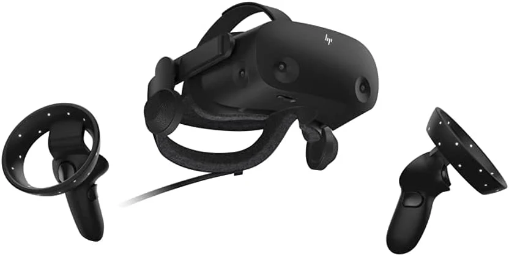

# Características Principales

- **Pantallas estereoscópicas**:

   Crean la ilusión de profundidad mediante dos imágenes ligeramente diferentes.

- **Sensores de movimiento**:

  Detectan los movimientos de la cabeza para ajustar la imagen que se ve en la pantalla.

  
- **Campo de visión amplio**:

   Generalmente entre 90° y 120° para una inmersión más realista.

- **Frecuencia de actualización alta**:

   Suele estar entre 60 Hz y 120 Hz para evitar mareos y mejorar la fluidez.

- **Seguimiento espacial**:

   Algunas incluyen cámaras o sensores externos para seguir la posición del usuario en el espacio.

   
