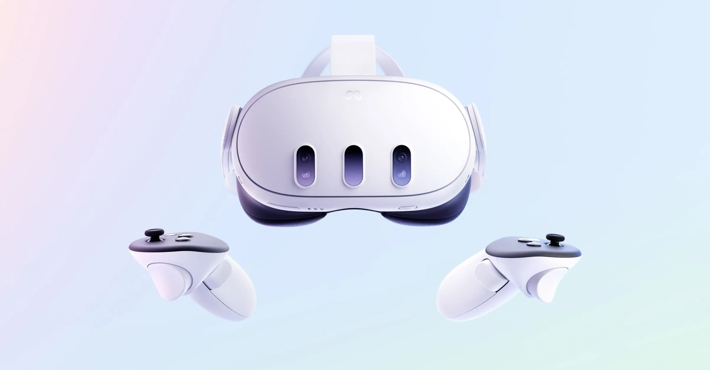
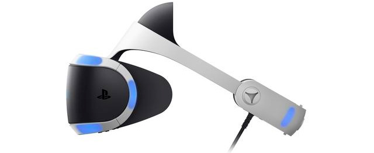
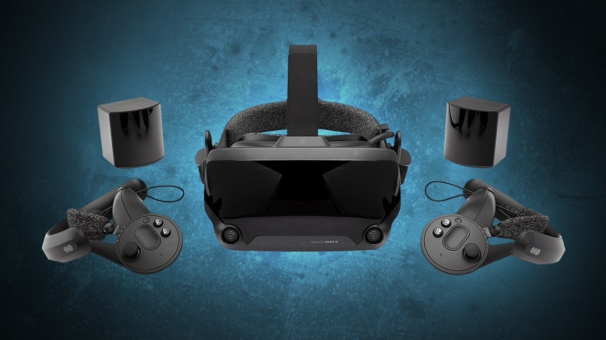
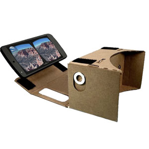

# Tipos de Gafas de Realidad Virtual

1. **Gafas autónomas**: No requieren conexión a un PC o consola.
   Ejemplo: Meta Quest 3.
   
3. **Gafas para PC/consolas**: Necesitan estar conectadas a un dispositivo potente.
   Ejemplo: PlayStation VR2, valve index
   
   
6. **Gafas para smartphones**: Usan el teléfono como pantalla y procesador.
   Ejemplo: Google Cardboard.
   
8. **Realidad mixta**: Combinan elementos virtuales con el entorno real.
   Ejemplo: Microsoft HoloLens.
   
